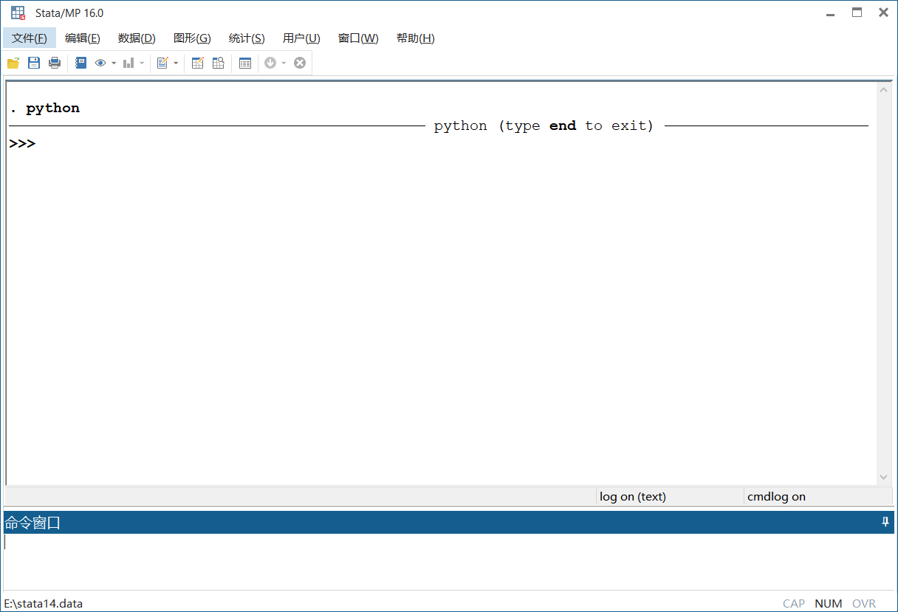
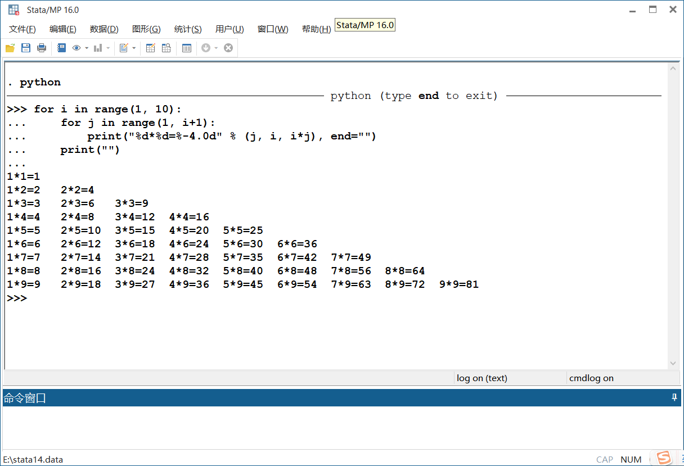
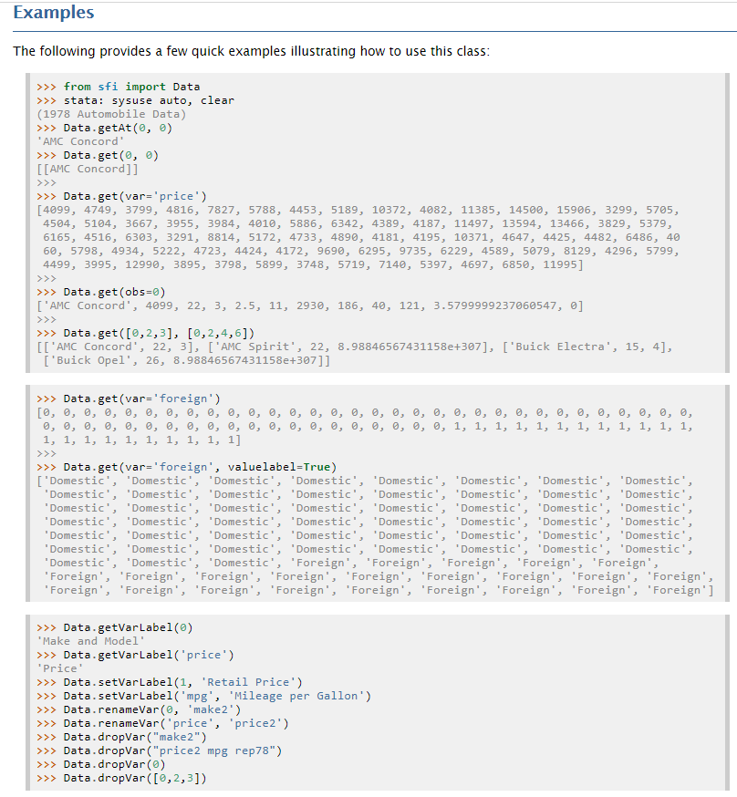
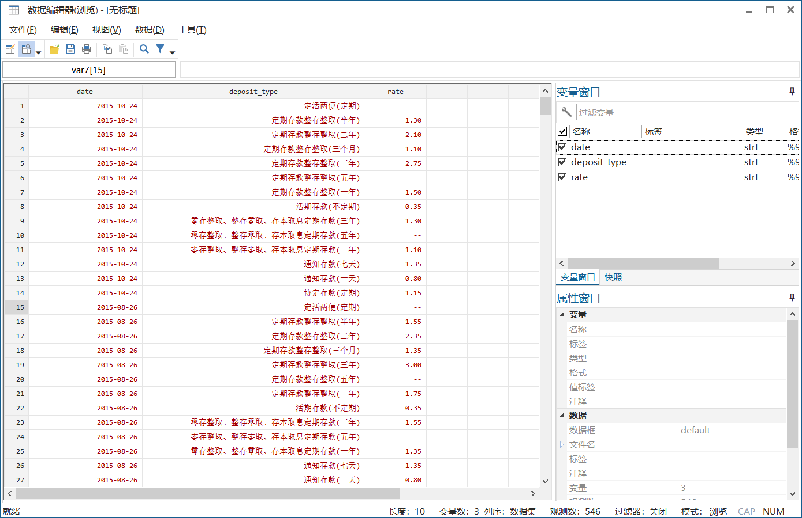
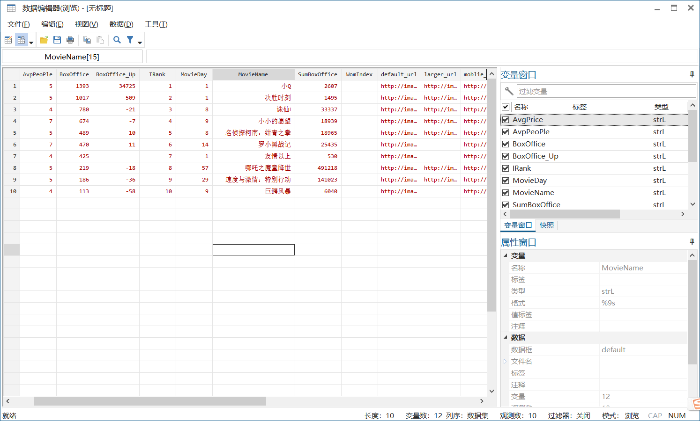
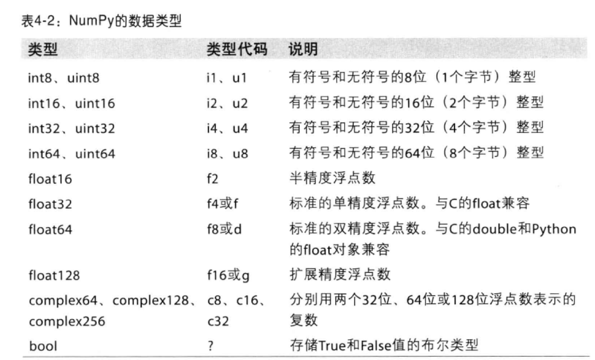
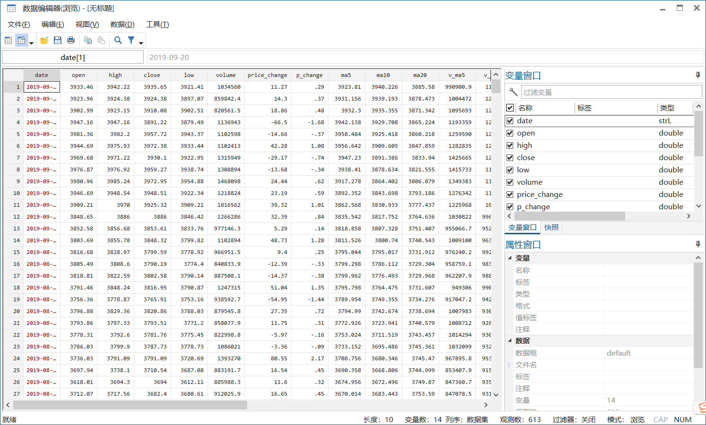
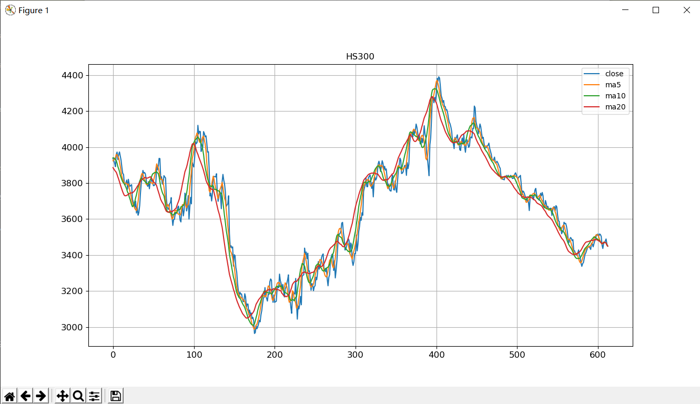

# Python与Stata的数据交互

最近拿到了Stata的船新版本——`Stata16`，就迫不及待地玩了两天。总的来说，Stata16不论在UI上，还是在功能上，都比之前的版本进步了许多。

特别值得一说的是，Stata终于牵手Python了——用户可以在直接进入Python的交互模式，或者运行Python的脚本。这样就可以借他山之石以攻玉。比如说，我们用Python爬取的数据，然后交由Stata进行处理；或者将Stata中的数据交由Python的Matplotlib库绘制三维图像等。这是Stata发展历程中的一大进步。

当然，Stata与Python的结合过程中仍然存在大量问题，需要Stata的开发人员持续改进。这一篇我们将结合Stata的Python开发文档（连接：https://www.stata.com/python/api16/index.html），来介绍二者之间的数据交互问题。

### 提要
[toc]

### 1. 进入Python交互模式
首先，你得确保的电脑上已经安装了Python，并且Stata中执行Python的路径设置正确。然后，你可以通过在命令窗口输入：
```
python
```
接着你就进入了如下图的Python交互模式:



然后你就可以数据Python的代码，Stata会自己调用Python解释器进行解释，然后输出结果。

比如，输入以下代码用于打印乘法口诀：

```python
for i in range(1, 10):
	for j in range(1, i+1):
		print("%d*%d=%-4.0d" % (j, i, i*j), end="")
	print("")
````

**注意缩进!!**Python对于缩进有严格规定。结果如下：



最后，你可以输入```end```以结束Python交互模式。


### 2. 从Tushare获取数据

Tushare是一个免费、开源的python财经数据接口包，在此向大家安利这个包，大家可以通过这个链接（https://tushare.pro/register?reg=224853）去注册使用。当然不注册也可以用。

由于Stata的Python API文档中关于```Data```类的介绍中已经举了一些**使用Python获取Stata中数据的例子**（链接https://www.stata.com/python/api16/Data.html#examples）。



因此，在这里，我就只介绍如何**使用Python获取的数据存储到Stata中**。这里我们主要使用的是```sfi```（Stata Function Interface）模块中的```Data```类。

```Data```类中```add```族方法用于向当前Stata数据集中添加观察值或变量；```get```族方法用于获取当前Stata数据集中的观察值；```set```族方法用于设置当前数据集的一些属性；```store```族方法用于将数据保存到当前Stata数据集中。

看下面代码：

```python
# 获取Tushare存款利率数据
clear
python:
from sfi import Data
import tushare as ts

# 创建数据集和变量
df = ts.get_deposit_rate()
Data.addObs(df.shape[0])
Data.addVarStrL('date')
Data.addVarStrL('deposit_type')
Data.addVarStrL('rate')

# 存储数据
Data.store('date', None, df.iloc[:,0])
Data.store('deposit_type', None, df['deposit_type'])
Data.store('rate', None, df['rate'])

end
br
```

第3行，用于进入Python交互模式；
第4~5行，导入相关的包；
第8行，从Tushare上获取存款基准利率；
第9行，调用```Data```类中的```addObs()```方法，用于给当前Stata数据集（空）中创建若干个观察值，相当于Stata中的命令```set obs 100```。```df.shape[0]```将返回数据的行数。
第10~12行，由于我已经知道了```df```中有3列数，且它们的类型都是```object```，因此这里将使用```addVarStrL()```方法创建3个字符串变量，变量名分别为```date```,```deposit_type```和```rate```。尽管已经创建了变量，但此时Stata数据集中仍然没有存储数据。
第15~17行，将```df```中的数据使用```store()```方法存储到刚才创建的变量中。
第19行，退出Python交互模式。

结果如下：



### 3. 多个变量
上述数据中只有3列数据，所以可以不辞辛苦地对每一个变量分别进行处理，那么如果变量很多呢？一个个地设置变量类型，然后存储数据，那将太麻烦了。因此，要写个循环。

代码如下：

```python
clear
python:
from sfi import Data
import tushare as ts

# 创建数据集和变量
df = ts.day_boxoffice()
Data.addObs(df.shape[0])
for i in range(0, df.shape[1]):
	Data.addVarStrL(df.iloc[:, i].name)

# 存储数据
for i in range(0, df.shape[1]):
	Data.store(df.iloc[:, i].name, None, df.iloc[:, i])
	
end
br
```
上述代码，是用于获取当日票房的数据的。比较简单，就不赘述了，结果如下：



###4. 多数据类型

也许你发现了，我们存到Stata中的数据都是字符串形式，这是因为上述```df```中的数据类型都是```object```类型，只能将其处理成字符串形式。那如果有些数据中包含整数或者浮点数呢？

在这里需要知道，Pandas库是基于Numpy库进行构建的。因此Pandas中的DataFrame的基本数据类型就是Numpy的基础数据类型，如下：



基于此，获取沪深300的历史数据的过程如下：

```python
clear

python:
from sfi import Data
import matplotlib.pyplot as plt
import numpy as np
import tushare as ts

# 定义数据类型
intList = [np.int8, np.int16, np.int32, np.int64,
		   np.uint8, np.uint16, np.uint32, np.uint64]
floatList = [np.float16, np.float32, np.float64]

# 获取数据
df = ts.get_hist_data('hs300')
df = df.reset_index()  # 将索引转化为列

# 添加变量
Data.addObs(df.shape[0]) 

for i in range(0, df.shape[1]):
	if df.iloc[:, i].dtype in intList:
		Data.addVarInt(df.iloc[:, i].name)
	elif df.iloc[:, i].dtype in floatList:
		Data.addVarFloat(df.iloc[:, i].name)
	else:
		Data.addVarStrL(df.iloc[:, i].name)

# 存储数据
for i in range(0, df.shape[1]):
	Data.store(df.iloc[:, i].name, None, df.iloc[:, i])

# 绘制图形
df[['close', 'ma5', 'ma10', 'ma20']].plot(
	kind='line',
	figsize=(16, 9), 
	grid=True, 
	title='HS300',
	fontsize=12)
plt.show()

end
br
```
第9~12行用于将```int```型和```float```的数据类型分别放到两个列表中。
第21~27行用于根据不同的数据类型来创建不同类型的变量；
第33~40行用于绘图。

获取数据结果如下：



绘制的图：



### 5. 还需要改进的地方

在Stata中运行Python代码是其一个长足的进步，但就目前来看，仍有许多改进的地方。

首先，SFI中没有将```DataFrame```数据直接转化为Stata当前数据集中的数据的相关API，还需要进一步的编程来实现，不是很方便

其次，```Data```类中没有设置**时间日期**类型变量的方法。这就使得任何时间变量要么以字符串的形式保存，要么转化为时间戳以整数或浮点数的形式保存（并且Stata和Python中关于时间戳的定义并不相同），因此，时间日期变量的处理就相当麻烦。

中肯地说，瑕不掩瑜。