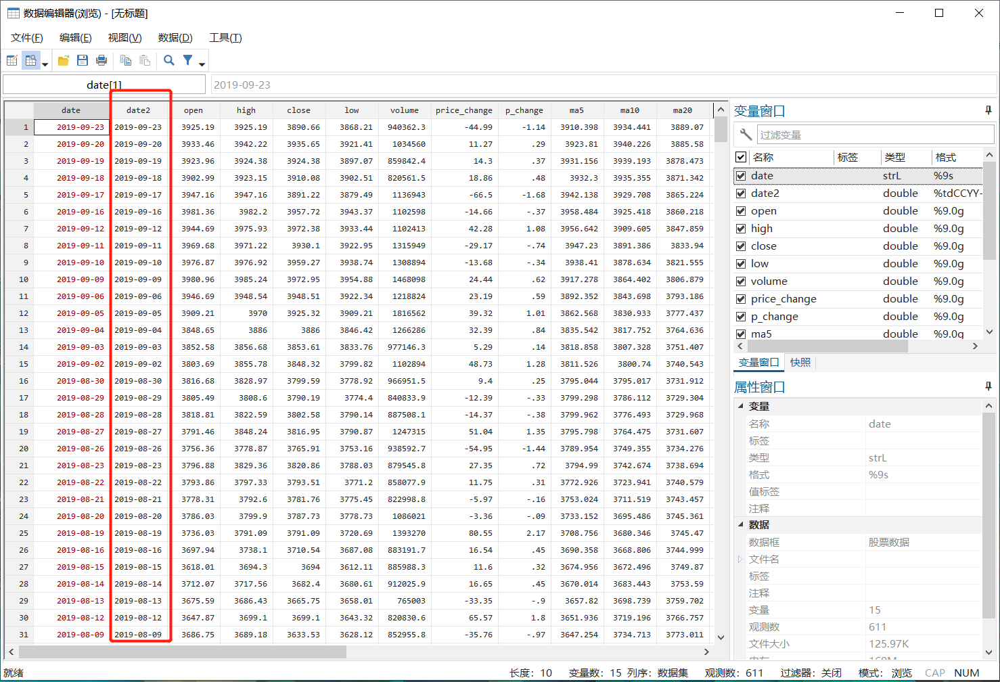
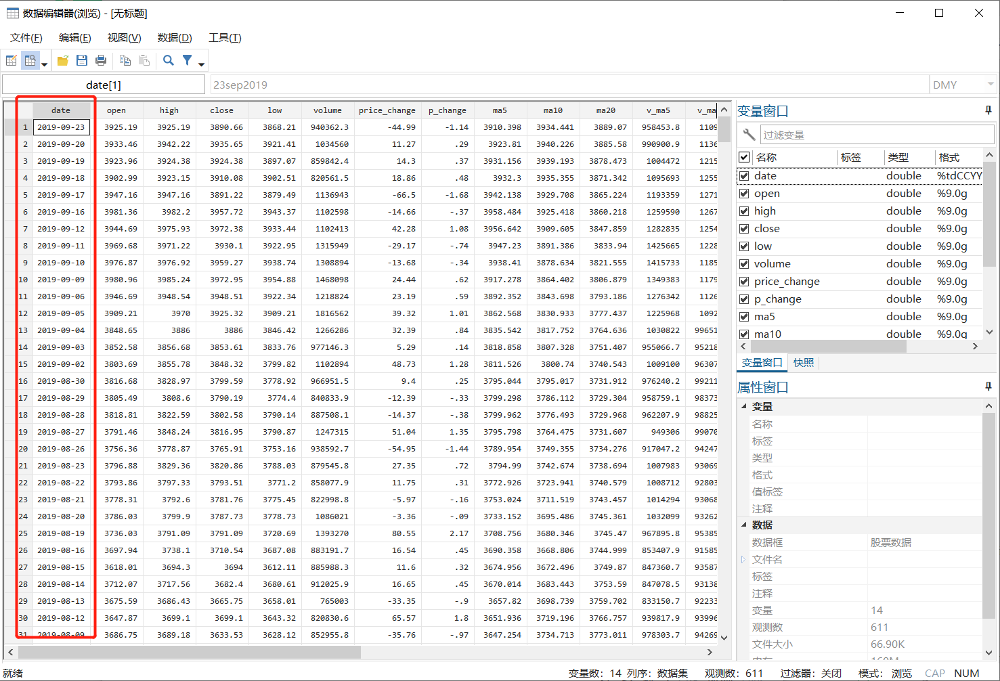

本篇将继续介绍Python与Stata的数据交互过程中的时间变量处理的问题。

**在开始介绍之前，通知一下：本文，包括之前部分文章的源代码已经托管至github上了，地址："https://github.com/zhangdashenqi/"，请需要的同学自取。**

###提要

[toc]

### 1. 使用Stata函数处理

在上一篇（传送门：==），我们介绍了在Stata16中Python和Stata的数据交互问题，但对于时间变量的处理还没有解决。这一篇将基于上一篇继续解决时间变量的处理问题。

首先，我们使用Stata中的时间函数来解决这个问题，代码如下：

```python
clear

python:
from sfi import Data
import numpy as np
import tushare as ts

# 定义数据类型
intList = [np.int8, np.int16, np.int32, np.int64,
		   np.uint8, np.uint16, np.uint32, np.uint64]
floatList = [np.float16, np.float32, np.float64]

# 获取数据
df = ts.get_hist_data('hs300')
df = df.reset_index()  # 将索引转化为列

# 添加变量
Data.addObs(df.shape[0]) 

for i in range(0, df.shape[1]):
	if df.iloc[:, i].dtype in intList:
		Data.addVarInt(df.iloc[:, i].name)
	elif df.iloc[:, i].dtype in floatList:
		Data.addVarFloat(df.iloc[:, i].name)
	else:
		Data.addVarStrL(df.iloc[:, i].name)

# 存储数据
for i in range(0, df.shape[1]):
	Data.store(df.iloc[:, i].name, None, df.iloc[:, i])
	
end

br
gen date2 = date(date, "YMD")
format date2 %tdCCYY-NN-DD
order date*
```

第35行，我们根据字符串变量```date```使用Stata内置函数```date()```来生成日期变量```date2```，相关用法可参看（连接：===）
第36行，设置日期变量```date2```的显示形式。

结果如下：



### 2. 使用Python处理
这里我们首先要从```sfi```模块中导入```Datetime```类，使用```Datetime```类中的相关方法完成处理时间变量的操作。

代码如下：

```python
clear

python:
from sfi import Data, Datetime
import pandas as pd
import numpy as np
import tushare as ts

# 定义数据类型
intList = [np.int8, np.int16, np.int32, np.int64,
		   np.uint8, np.uint16, np.uint32, np.uint64]
floatList = [np.float16, np.float32, np.float64]

# 获取数据
df = ts.get_hist_data('hs300')
# df = df.reset_index()  # 将索引转化为列

# 处理时间变量
df.index = pd.to_datetime(df.index.tolist()) # 将object转换为Datetime
dateSIF = [Datetime.getSIF(i, '%tdCCYY-NN-DD') for i in df.index]

# 添加变量
Data.addObs(df.shape[0]) 

Data.addVarFloat('date')  # 添加Date变量

for i in range(0, df.shape[1]):
	if df.iloc[:, i].dtype in intList:
		Data.addVarInt(df.iloc[:, i].name)
	elif df.iloc[:, i].dtype in floatList:
		Data.addVarFloat(df.iloc[:, i].name)
	else:
		Data.addVarStrL(df.iloc[:, i].name)

# 存储数据
Data.store('date', None, dateSIF) # 存储时间变量
Data.setVarFormat('date', '%tdCCYY-NN-DD')  # 设置变量形式

for i in range(0, df.shape[1]):
	Data.store(df.iloc[:, i].name, None, df.iloc[:, i])

end
br
```

第19行，数据```df```的索引的数据类型本来是```numpy.object```类型，这里我们使用Pandas内置方法```pd.to_datetime()```将其索引类型转变为```Datetime```类型。
第20行，使用```sfi```模块中的```Datetime.getSIF()```方法将上述索引通过**列表推导式**转换为一个列表。```SIF```即Stata Internal Form，是Stata以数字形式存储时间变量的一种格式（类似于时间戳的概念）。可参见：=====
第25行，上述代码得到的```dateSIF```是一个浮点数组成的列表，因此，我们需要添加浮点数变量以存储时间变量。
第36行，将```dateSIF```存储到之前定义的时间变量```date```中。
第37行，使用```Data.setVarFormat()```设置时间变量的显示形式。

结果如下：



可以看出，生成的```date```变量都是日期类型的变量。


### 3. 一些改进

上述代码，在迭代的时候使用的是下标迭代的方式，这种方式简单且容易理解，但对于变量很多的情况，速度就会比较慢。

幸好，Pandas自身提供了一些迭代的方法，如下代码的第20~27行。这里请感兴趣的同学去参看Pandas的文档，我就不再赘述了。

```python
clear

python:
from sfi import Data
import numpy as np
import tushare as ts

# 定义数据类型
intList = [np.int8, np.int16, np.int32, np.int64,
		   np.uint8, np.uint16, np.uint32, np.uint64]
floatList = [np.float16, np.float32, np.float64]

# 获取数据
df = ts.get_hist_data('hs300')
df = df.reset_index()  # 将索引转化为列

# 添加变量
Data.addObs(df.shape[0]) 

for item, frame in df.iteritems():
	if frame.dtype in intList:
		Data.addVarInt(item)
	elif frame.dtype in floatList:
		Data.addVarFloat(item)
	else:
		Data.addVarStrL(item)
	Data.store(item, None, frame) # 存储数据
	
end
br

```
