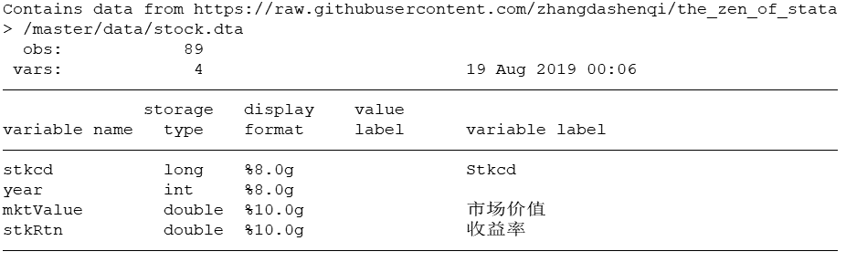
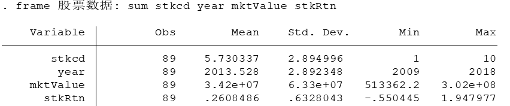
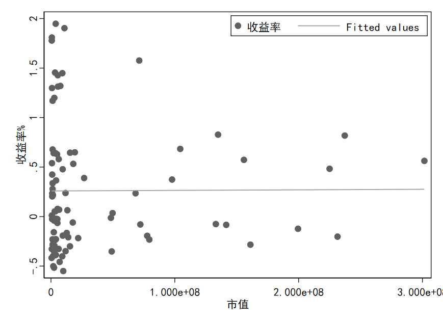

这一篇我们介绍Stata16中`data frames`(数据框)的使用方法。在Stata16之前的版本，Stata的内存中只能存储一份数据集，这在实际使用中非常不便。

Stata16中增加的`data frames`允许你在Stata内存中同时存储、操作多份数据集，并且可以将这些数据连接起来，极大提升了数据处理的效率。

下面我们简单介绍`data frames`的使用方法。

### 提要

[toc]

### 1. 数据框的创建

首先载入一份股票数据。

```c
// 设置参数
global github "https://raw.githubusercontent.com/zhangdashenqi"
webuse set "${github}/the_zen_of_stata/master/data"

// 载入股票数据
webuse stock.dta, clear
```

这份数据我已经上传到`github`上了。你可以通过第2、3行设置参数，然后通过`webuse`命令获取该数据。

如果出现无法载入的情况，请多试几次。或者从`github`上手动下载（传送门：https://github.com/zhangdashenqi/the_zen_of_stata/tree/master/data）。

这个时候Stata的内存中已经存在了`stock.dta`这个数据集了。这份数据集主要包含了股票市值和收益率数据。



然后我们再载入另一份数据关于股票账面价值的数据：

```c
frame create 账面价值
frame 账面价值: webuse bookValue.dta, clear
```
第1行，用于创建一个名为`账面价值`的数据框；
第2行，我们指定在`账面价值`数据框中执行`webuse bookValue.dta, clear`命令，用于载入`bookValues.dta`数据集。

那么现在，我们的内存中就有两份数据集了。

### 2. 数据框的查询

怎么确定内存中有两份数据集呢？我们可以试着输入以下命令：

```c
frame dir   // 查询内存中的所有数据框
```
将会显示：
>   default　　　　89 x 4; stock.dta
  账面价值　　　90 x 3; bookValue.dta

表明内存中存在两份数据集：`default`和`账面价值`。
`default`数据框是系统默认的数据框，它保存了我们第一载入的数据集`stock.dta`。

当然你也可以对`default`数据框重命名，将`default`命名为`股票数据`:

```c
frame rename default 股票数据
frame dir
```
> 股票数据　　　89 x 4; stock.dta
  账面价值　　　90 x 3; bookValue.dta


### 3. 数据框的切换

```c
frame change 账面价值
cwf 账面价值  // 效果同上
```
那么我们已将将工作的数据框切换至`账面价值`了，然后可以使用以下两种方式查询当前工作的数据框：
```c
frame pwf      // 查询当前工作的数据框
pwf			// 同上
```
结果为：
>  (current frame is 账面价值)

### 4. 操作数据框中数据

当前工作的数据框为`账面价值`，如何在不切换数据框的前提下，调用其他数据框中的数据呢？

Stata提供了两种方式：

如果命令比较短，只有一行，那么可以采用冒号`:`方式：
```c
frame 股票数据: sum stkcd year mktValue stkRtn
```
结果为：




如果命令比较长，可以采用花括号的方式：
```c
frame 股票数据{
	#delimit ;
	twoway (scatter stkRtn mktValue)
		   (lfit stkRtn mktValue),
		ytitle("收益率%")
		xtitle("市值")
		legend(ring(0) pos(1))
		scheme(s1mono)
	;
	#delimit cr
}
```
结果为：

