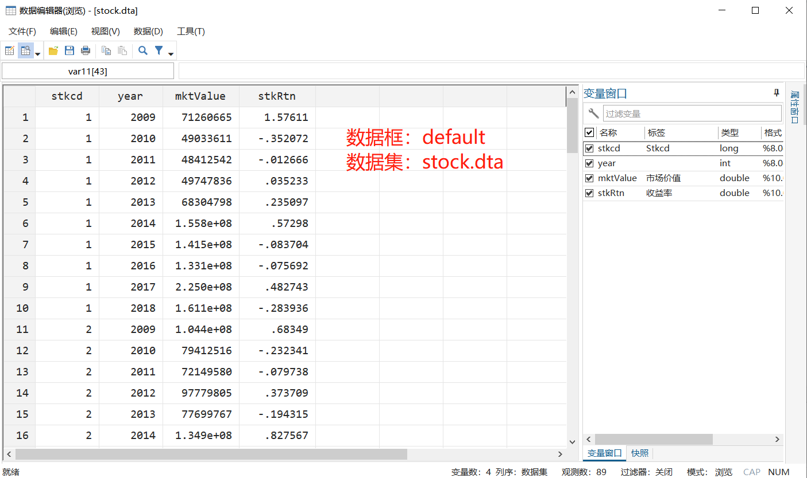
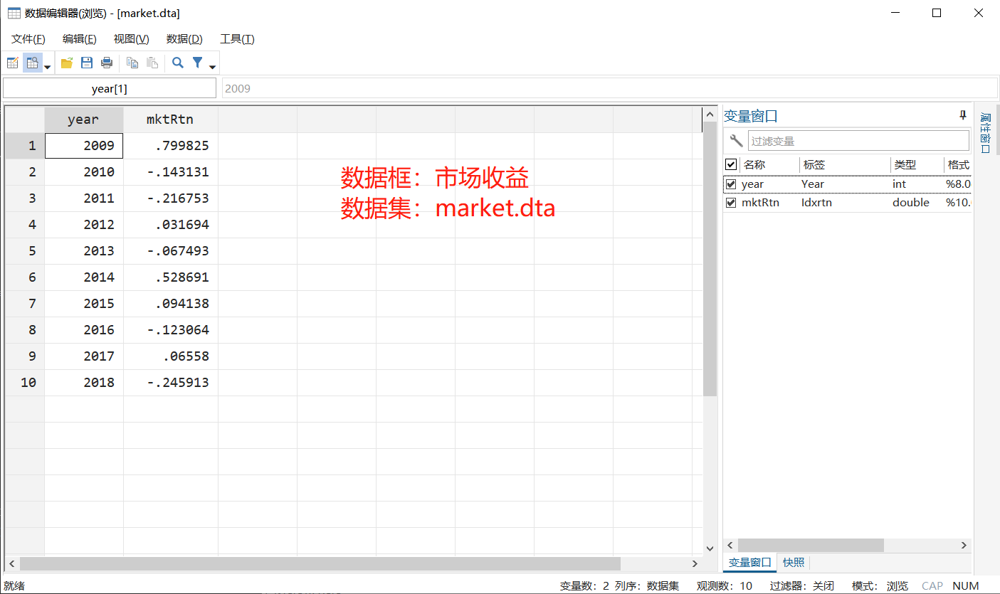
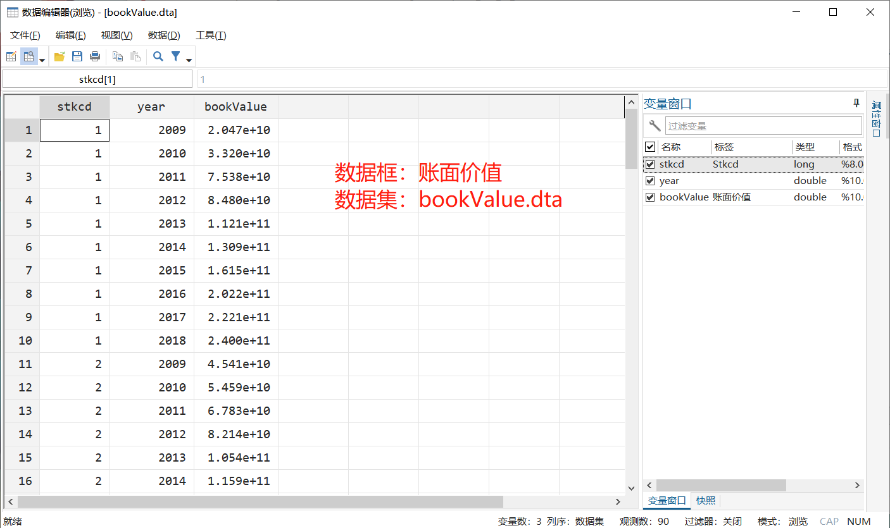
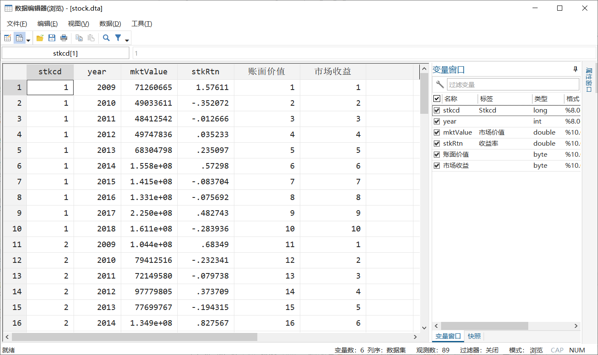
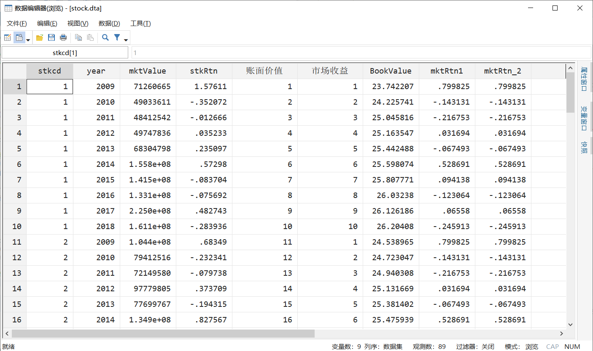

书接上回，我们介绍了Stata16中`data frames`的基础用法，当然这些用法不足以体现`data frames`强大威力。本篇我们将介绍`data frames`的连接和变量的获取。

### 提要

[toc]

### 1. 数据准备

本文所使用的演示数据全部上传至我的`github`上了，你可以通过设置相应参数，使用Stata`webuse`命令直接获取。也可手动下载。关于数据的介绍也可参看（连接：）

```c
// 设置参数
global github "https://raw.githubusercontent.com/zhangdashenqi"
webuse set "${github}/the_zen_of_stata/master/data"

// 载入股票数据
webuse stock.dta, clear

// 创建2个新的数据框
frame create 账面价值
frame 账面价值: webuse bookValue.dta, clear

frame create 市场收益
frame 市场收益: webuse market.dta

frame dir
```
第1~3行，设置获取`github`数据的参数；
第6行，获取第1份数据集`stock.dta`，将保存在默认的数据框`default`中；
第9~10行，创建数据框`账面价值`，并载入数据集`bookValue.dta`；
第12~13行，创建数据框`市场收益`，并载入数据集`market.dta`;
第15行，查询已有的数据框。

结果应为：

> default　　　　　89 x 4; stock.dta
  市场收益　　　　10 x 2; market.dta
  账面价值　　　　90 x 3; bookValue.dta

表明当前内存中存在三个数据框。然而这样并不能使你们了解这些数据的状态。我将它们截图如下：







可以看出`stock.dta`和`bookValue.dta`数据都是面板数据，而`market.dta`数据为时间序列数据。

### 2. 数据框的连接

其实数据框的连接和数据集的合并道理是差不多的。数据集的合并在Stata中使用`merge`命令来完成。数据框的连接则由命令`frlink`完成。
```c
// 连接数据框
frame change default    // 确保当前数据框为default
frlink 1:1 stkcd year, frame(账面价值)
frlink m:1 year, frame(市场收益)
```
第2行，我们首先确保当前工作的数据框为`default`，即，使用的是`stock.dta`数据集；
第3行，将当前数据框与`账面价值`数据框连接起来。我们知道当前数据集`stock.dta`与`账面价值`数据框中的`bookValue.dta`数据集都是面板数据，可以通过`stkcd`和`year`这两个变量唯一确定联系，因此`frlink`后跟`1:1`；
第4行，将当前数据框与`市场收益`数据框连接起来。`frlink`后应为`m:1`，这是一个多对一的“匹配”。

合并完之后的效果：



可以看出，数据框连接完成后，就生成了同名数据框变量`账面价值`和`市场收益`。这些变量的值就表示索引（或称之为“键”）。如果是`1:1`匹配的，那么这些索引就是唯一的，不会重复的；如果是`m:1`匹配的，那么索引就不是唯一的。

### 3. 从连接的数据框中获取变量

解决了数据框连接的问题后，我们应该关心如何调用其他数据框中的变量。Stata提供了两种方式：

一是`frvall()`函数。例如我们获取`账面价值`数据框中的`bookValue`变量，并将其取对数以生成新的变量`BookValue`，相应的操作：

```c
// 以frval()函数的形式
gen BookValue = ln(frval(账面价值, bookValue)) 
```

函数`frval()`第一个参数为数据框名称，第二个参数为变量名称。

二是`frget`命令。它的用法可以有以下两种：
```
// 以frget命令
frget mktRtn1 = mktRtn, from(市场收益) 
frget mktRtn, from(市场收益) suffix(_2)
```
第1种是生成变量`mktRtn1`，令其等于原变量`mktRtn`；第2种则没有`=`，但是可以添加后缀选项`suffix()`，用于给新生成的变量后面添加`_2`后缀。但注意，`from()`选型用于指定数据框，必不可少。

结果为：



以上，关于数据框的基本操作就介绍完了，当然还有许多我们所没有涉及到了。如果你想了解更多，可以`help frame`。